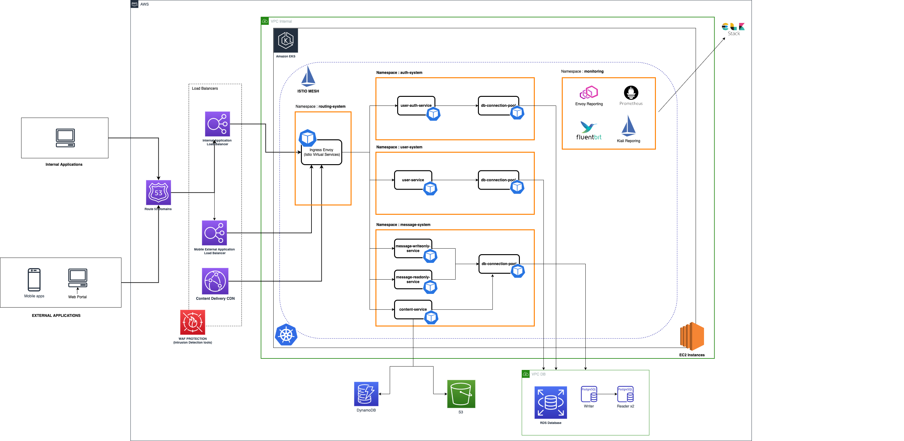

# Twitter like messaging system

The document provides information on a proposed architecture and tool for designing and developing a twitter like messaging system

Scope - There are a few assumptions made while designing the system . The system includes below features

* User able to post a public message
* Users able to read all public messages
* The messages are in text format
* A small to medium scale application that can be scaled easily

## Architecture Design Diagrams

### High Level Architecture Diagram


### Backend Architecture AWS Kubernetes



## Tools and Frameworks

* Helm
* Minikube
* kubectl
* Docker
* Rust
* Postgresql 11
* Flyway 6

## Local Environment Setup

* Setup kubectl <https://kubernetes.io/docs/tasks/tools/>
* Setup Minikube <https://minikube.sigs.k8s.io/docs/start/>
* Setup Helm <https://helm.sh/docs/intro/install/>
* Setup Rust <https://www.rust-lang.org/tools/install>
* Setup Docker <https://docs.docker.com/get-started/>

Build Images and push images to a docker registry of your own preference . I used dockerhub for this assignment

```sh
# db migration image publish , Asumming that you have performed docker login
docker build . -f db-migration.init.Dockerfile -t db-migration-messages:0.1
docker tag db-migration-messages:0.1 <repo>/<image>:<tag>
docker push <repo>/<image>:<tag>

# service image build and publish . 
docker build . -f Dockerfile -t message-service:0.1
docker tag message-service:0.1 <repo>/<image>:<tag>
docker push <repo>/<image>:<tag>

# Helm update repository dependencies , this should download the postgres chart dependency . Refer Chart.yaml
helm repo update

# Install helm for the the service . This should install postgres database and install schema via init-container with flyway migration
helm upgrade message-service --namespace message-services ./helm/message-service --install --create-namespace

# The application is configured to be exposed via a NodePort directly for easy test . Check minikube service list for ip and port for accessing application
minikube service --list 
```

## Swagger Documentation

Refer to the swagger doc [API Documentation](doc/openapi.yml)
Use a swagger editor of your own choice to view the openapi document
[VSCode Extension](https://marketplace.visualstudio.com/items?itemName=42Crunch.vscode-openapi)

## Plantuml DB Design

Refer to the simple DB Design for RDS [PostgreDB](database.wsd)
[Vscode Extension](https://marketplace.visualstudio.com/items?itemName=jebbs.plantuml)
